# Red Hot Oven - Baking App
What will you bake in your oven next? 

## About -

The app will:

1. Upon launch, present the user with an arrangement of desserts (photo + name)
	* As a linear arrangement for phones in portrait mode
	* As a grid arrangement (2 columns) for phones in landscape mode
	* As a grid arrangement (2 columns) for tablets in portrait mode
	* As a grid arrangement (3 columns) for tablets in landscape mode	
2. Click on dessert item will lead to 
	* a fragment showing recipe ingredients & steps in phone
	* a master-detail layout showing recipe ingredients, steps, and step details in tablet
3. For phones, step details will be shown in a view pager
4. If available, videos per step will be shown to the user
5. Videos in phones are shown full screen if user views steps in landscape mode
6. User can add a widget to their home screen that shows the ingredient list for a recipe

## Concepts covered -
1. Use of **Repository** pattern with **Retrofit**, **Room**, **LiveData** & **NetworkBoundResource** to get data 
2. Use of **Glide** to display images from URLs
3. **Recyclerview** and GridLayoutManager
4. **Intents** to navigate to new activities, or to perform actions (external intents)
5. **Layout** changes according to device orientation change
6. **Master-Detail flow** layout for tablets
7. **ExoPlayer** for playing video, with option to toggle fullscreen mode
8. Home screen **widget** to display ingredient list for a recipe
9. **onSaveInstanceState()** to restore state after orientation change
10. **Timber** library for logging
11. **MVVM** architecture
12. **Dagger 2** for dependency injection
13. UI tests with **Espresso**
14. **Coordinator layout**
15. **Splash** screen
16. **View Pager** for showing all the recipe steps

## Video - 
[Dessert List, About, and Recipe](screens/video1.gif)

[Recipe and Steps navigation, Video player](screens/video2.gif)

## Screens -
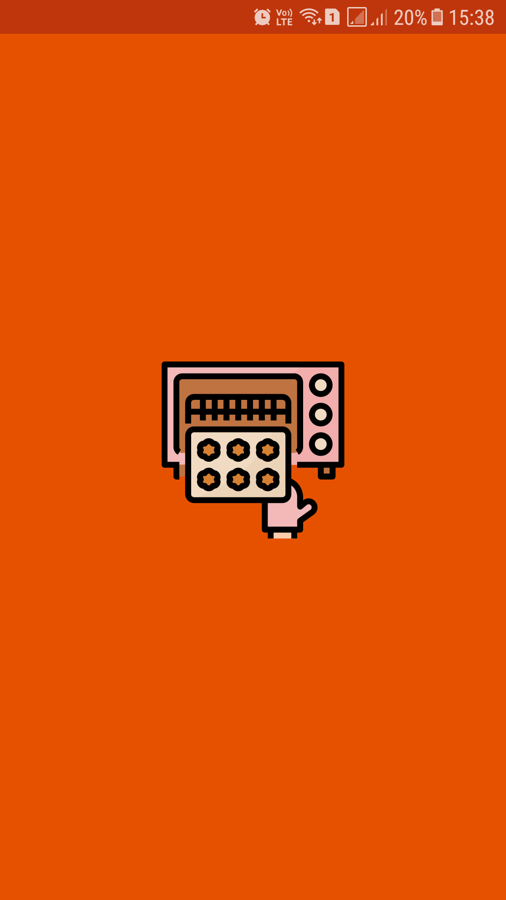

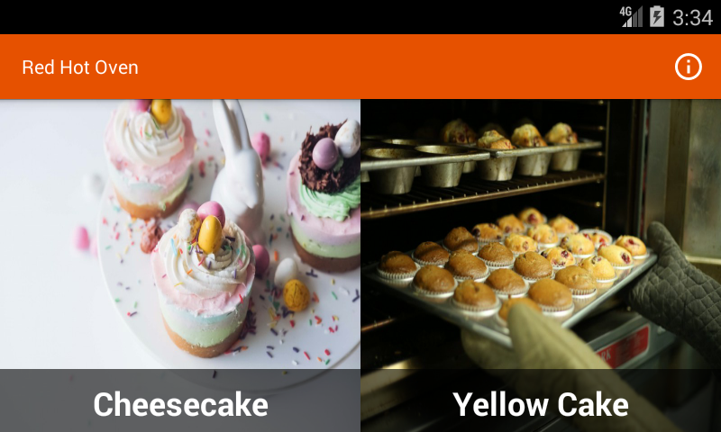

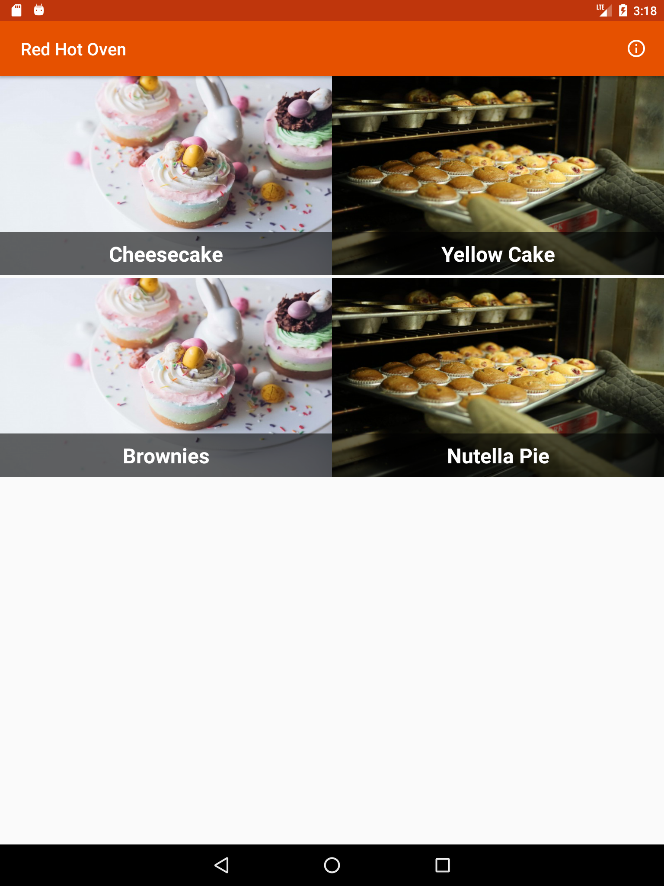

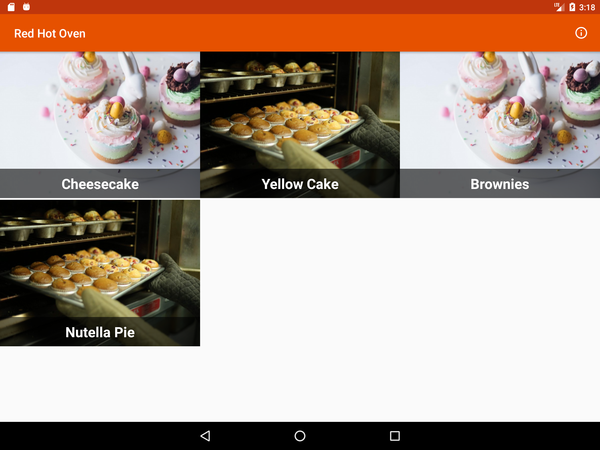

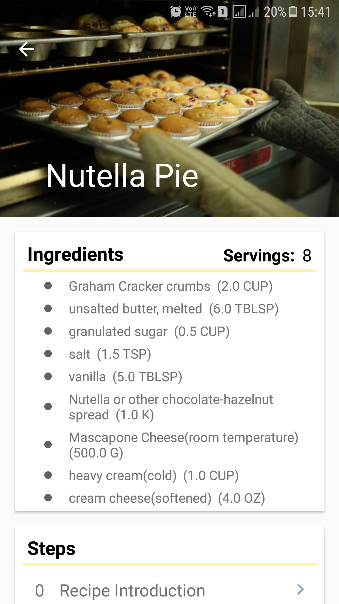

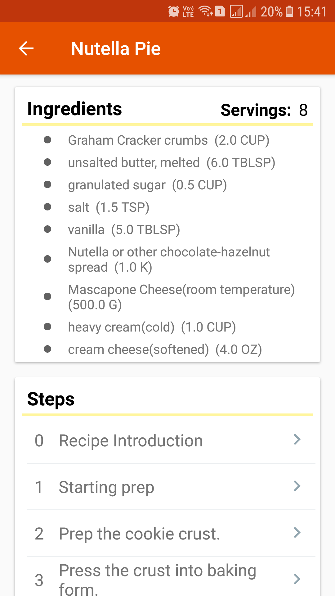

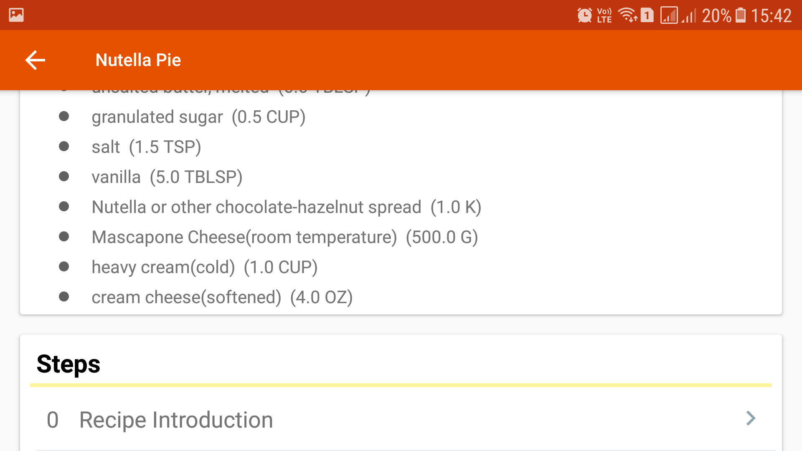

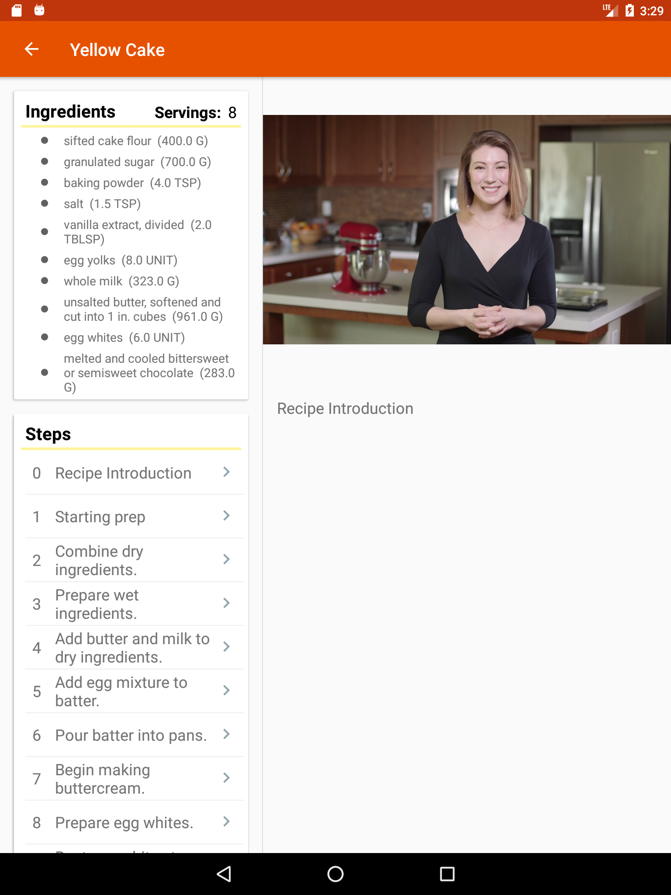

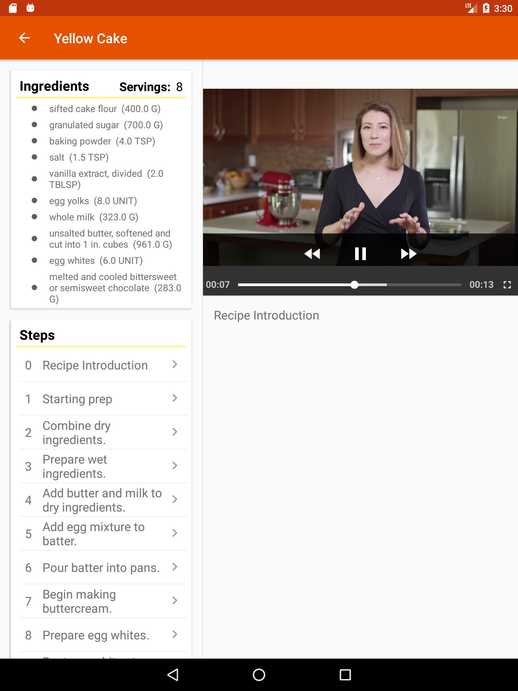

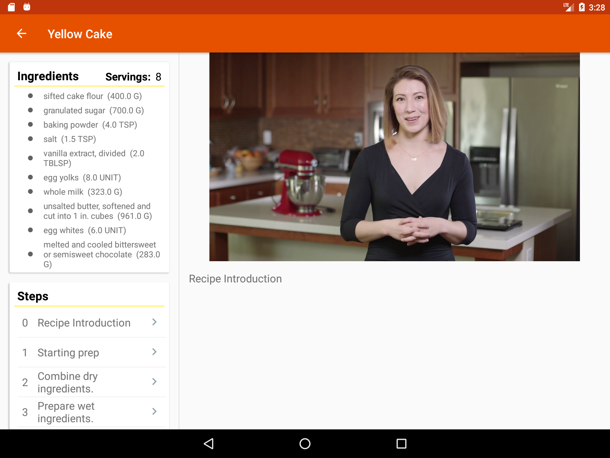

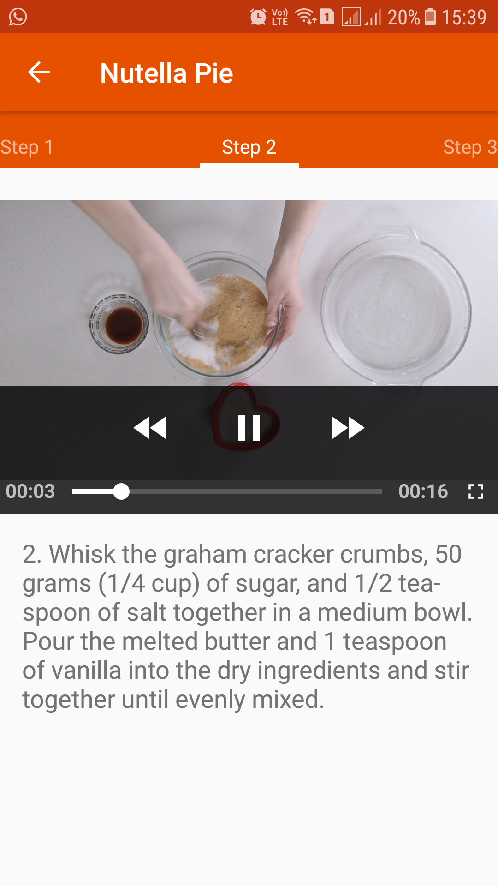

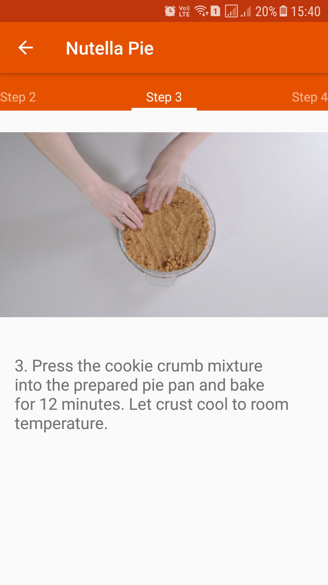

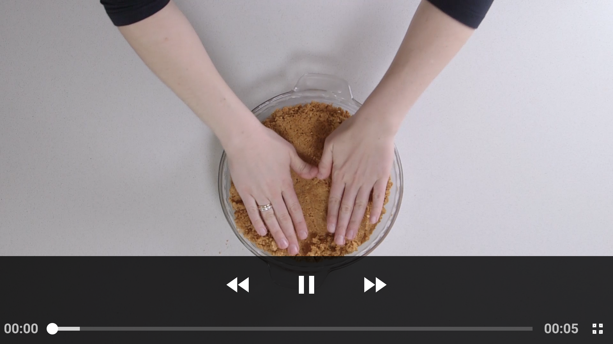

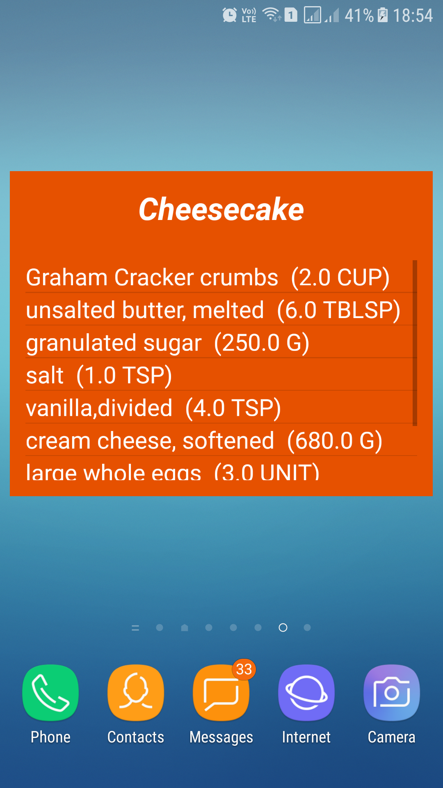

