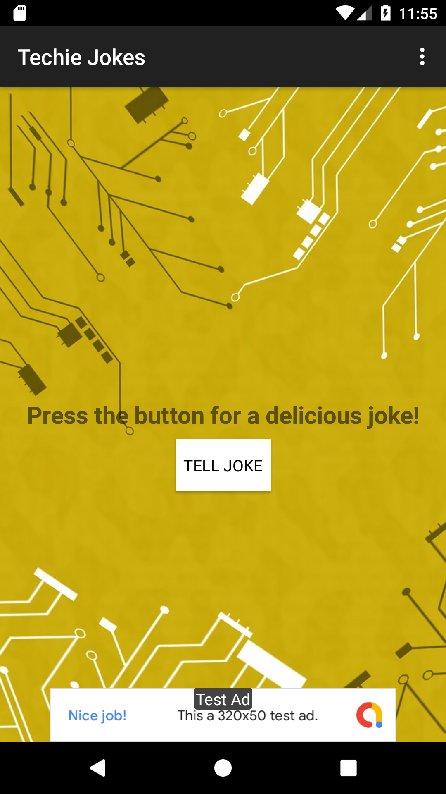
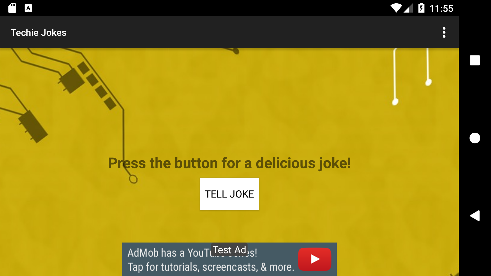
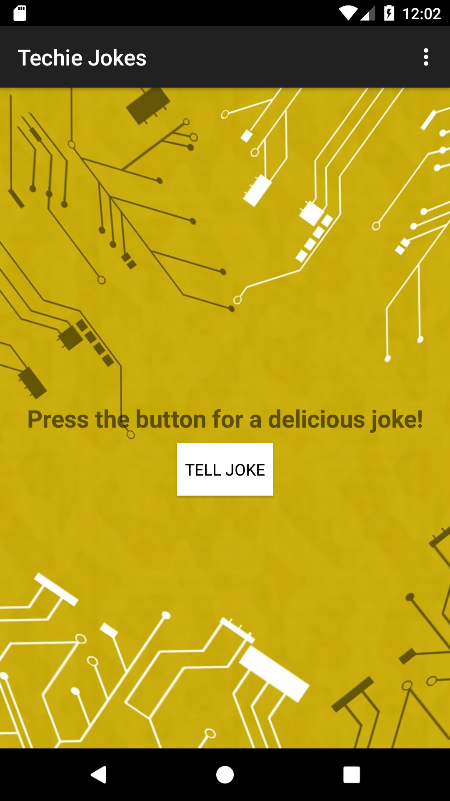
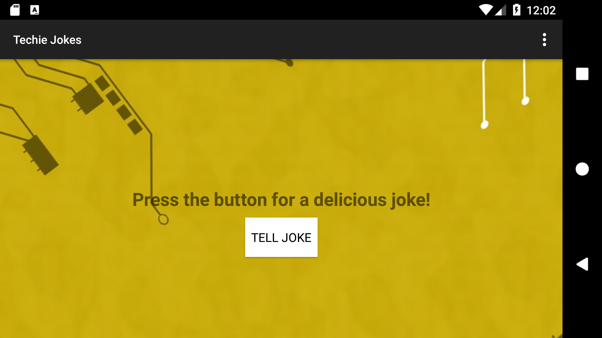
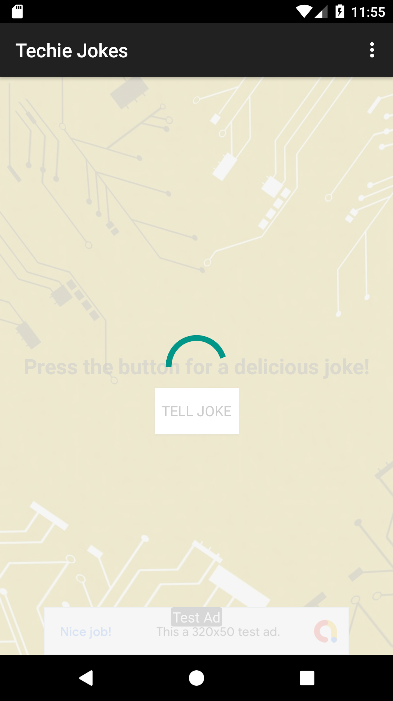
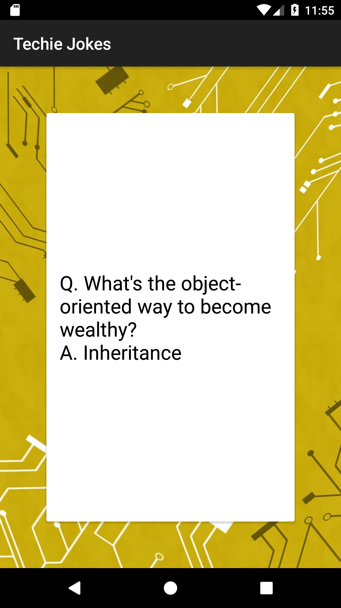
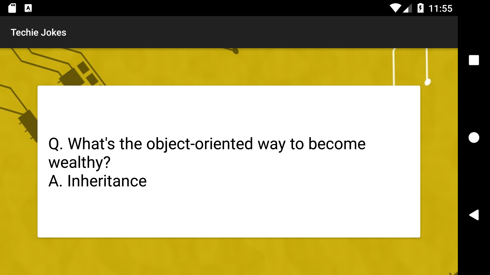

# Build It Bigger Project - Gradle for Android and Java

This project app has multiple flavors and uses multiple libraries and Google Cloud Endpoints. The app consists of four modules. 
1. A Java library that provides jokes, 
2. a Google Cloud Endpoints (GCE) project that serves those jokes, 
3. an Android Library containing an activity for displaying jokes, 
4. and an Android app that fetches jokes from the GCE module and passes them to the Android. Library for display.

## Learning from this project

This project teaches the role of Gradle in building Android Apps and how to use
Gradle to manage apps of increasing complexity. Concepts covered include - 

* Adding free and paid flavors to an app, and setting up your build to share code between them
* Factoring reusable functionality into a Java library
* Factoring reusable Android functionality into an Android library
* Configuring a multi project build to compile your libraries and app
* Using the Gradle App Engine plugin to deploy a backend
* Configuring an integration test suite that runs against the local App Engine development server

## Screens

 Free Version Main Screen

 Free Version Main Screen Landscape

 Paid Version Main Screen

 Paid Version Main Screen Landscape

 Loading

 Joke

 Joke Screen Landscape

## Steps for GCE setup

This task will be pretty tricky. Instead of pulling jokes directly from
our Java library, we set up a Google Cloud Endpoints development server,
and pull our jokes from there. The starter code already includes the GCE module 
in the folder called backend.

Before going ahead you will need to be able to run a local instance of the GCE 
server. In order to do that you will have to install the Cloud SDK:

https://cloud.google.com/sdk/docs/

Once installed, you will need to follow the instructions in the Setup Cloud SDK
section at:

https://cloud.google.com/endpoints/docs/frameworks/java/migrating-android

Note: You do not need to follow the rest of steps in the migration guide, only
the Setup Cloud SDK.

Start or stop your local server by using the gradle tasks as shown in the following
screenshot:

Once your local GCE server is started you should see the following at 
[localhost:8080](http://localhost:8080)

Now you are ready to continue! 

## Rubric

### Required Components

* Project contains a Java library for supplying jokes
* Project contains an Android library with an activity that displays jokes passed to it as intent extras.
* Project contains a Google Cloud Endpoints module that supplies jokes from the Java library. Project loads jokes from GCE module via an async task.
* Project contains connected tests to verify that the async task is indeed loading jokes.
* Project contains paid/free flavors. The paid flavor has no ads, and no unnecessary dependencies.

